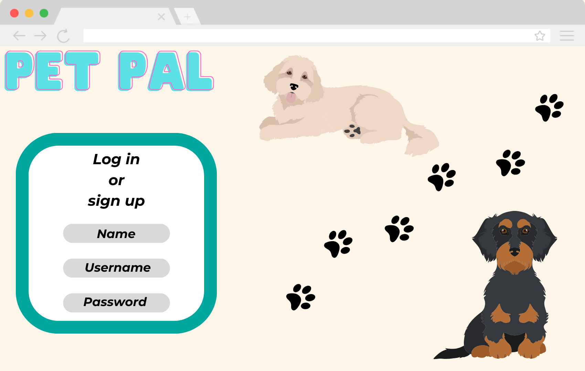
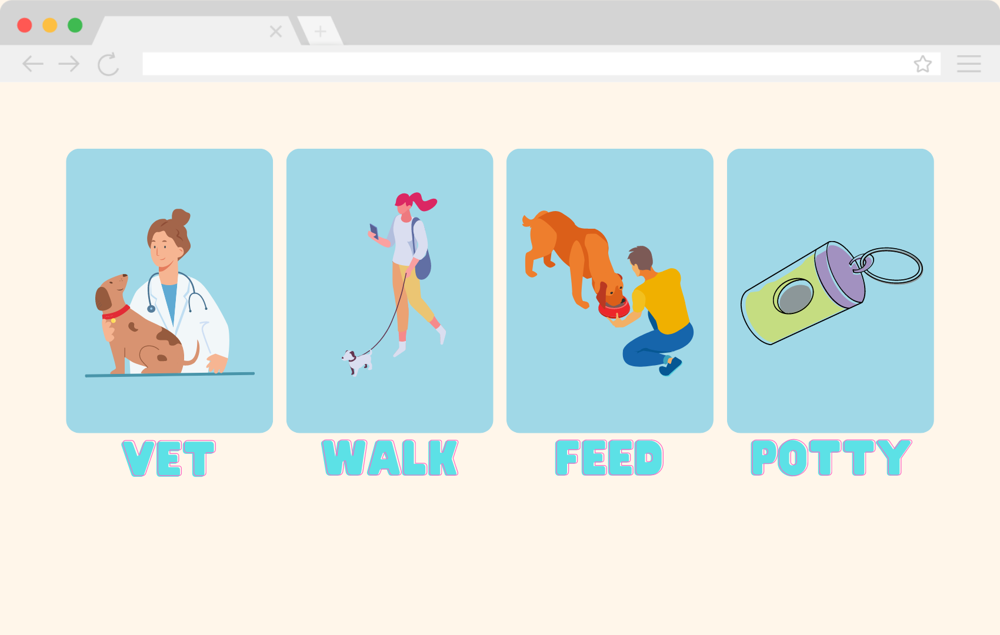
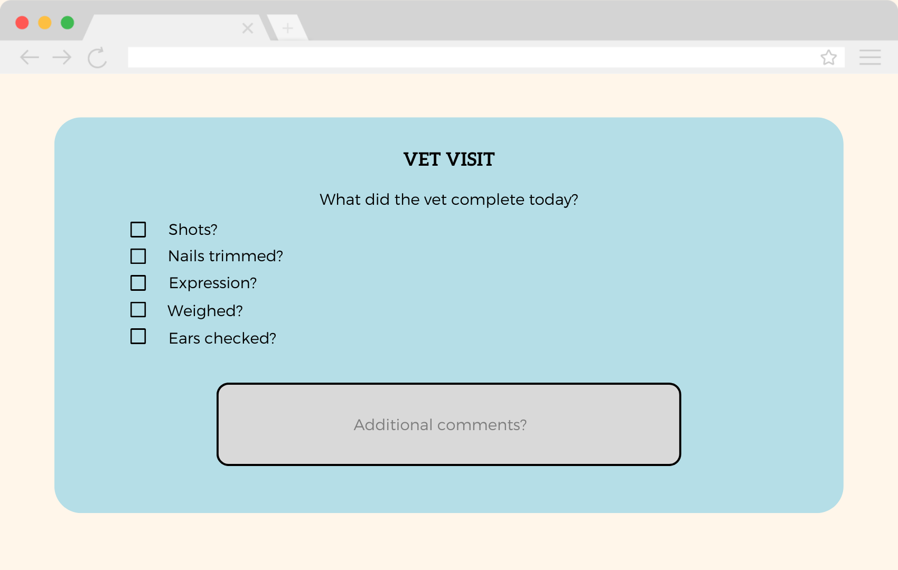
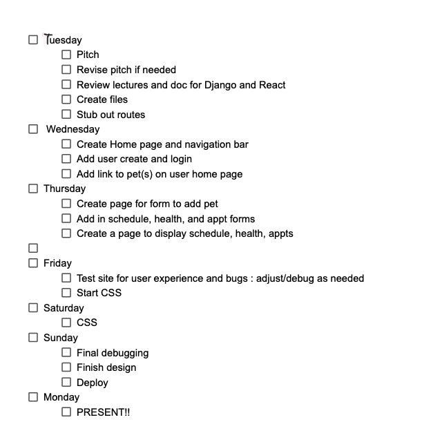
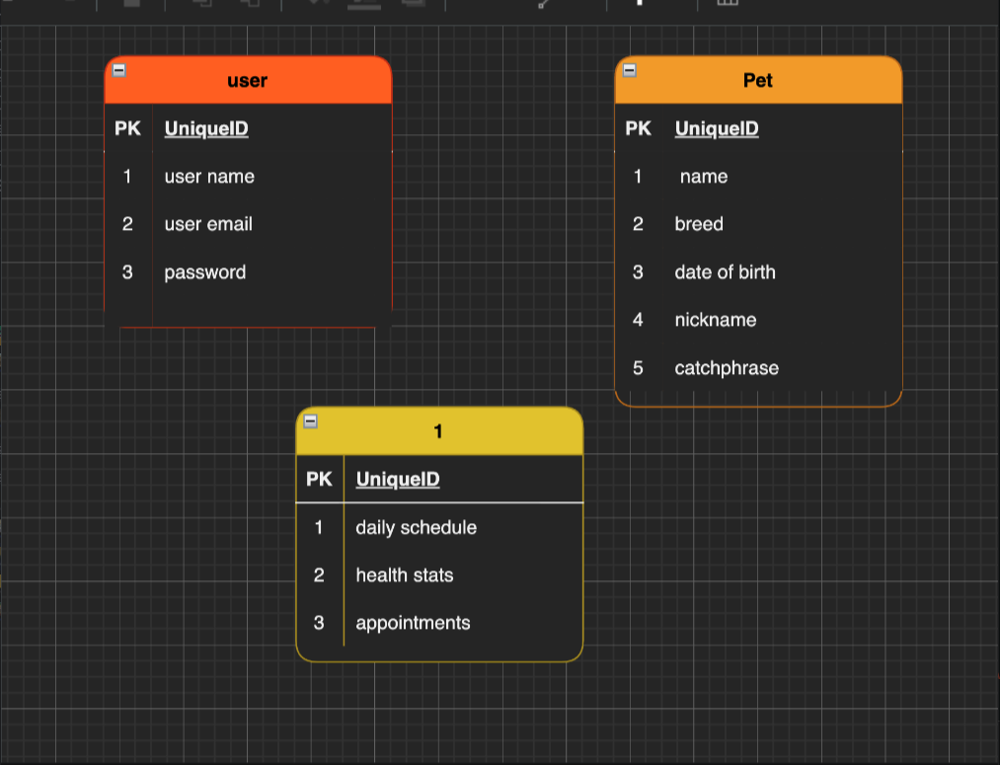

# Pet Pal

## Tech stack
- Django
- React
- HTML
- Tailwind
- Css

## Approach
Our general approach was for Michelle to take on making the backend and I(Megan) made the frontend. We planned out a couple files for each day and tried to implement them. We wanted it to be a single page app, so the user didn't have to click around to enter tehir data.

## Installation instruction
1. Fork and clone repository
2. In your terminal run npm i (this will install all dependancies)
(if they're not there, touch a .gitignore file and add your node_modules folder)
3. Run NPM start and start your coding 

## App description
Pet Pals is a fur-friendly application! With Pet Pals, you can keep track of feeding schedules, vet visits, potty trips, and walks. Did your pet just have a vet visit? Log it on our vet visit form. Keep track of their weight, shots, or when they need their flea medicine. You can also keep track of the last time your pet was let out or went potty. Log your pet walks and how long you were getting some good exercise. Have multiple pets? Great! Add them all under your user to get started!

## Wireframes

## User Stories
- As a user I would like to make an account and log on
- as a user I would like to make a pet 'user' 
- as a user I would like to log vet visits on the vet form
- as a user I would like to log how long i walked my pet
- as a user i would like to see a schedule of when i have and haven't fed my pet
- as a user i would like to see a list of potty trips
- as a user i would like to be able to log potty trips
- as a user i would like to be able to add multiple pets

## Team
- Michelle Elek
- Megan Benn

## Work Schedule

## ERD

